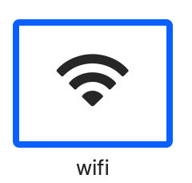
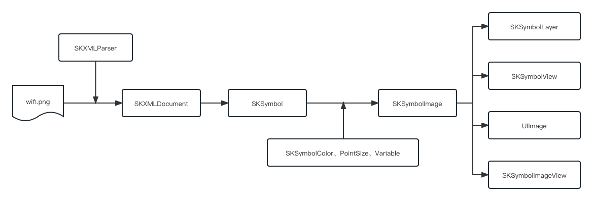

# SFSymbolKit 使用文档

## 1. 导入 SFSymbolKit 库

```rub
pod 'SFSymbolKit'
```

```objc
#import <SFSymbolKit/SFSymbolKit.h>
```

****

## 2. 导出 SFSymbol 符号文件

1. 从苹果官网下载 [SF Symbol.app](https://developer.apple.com/sf-symbols/) 并安装到你的 Mac 上
1. 在该应用中选择一个你要导出的 SF Symbol，这里举例: `WiFi` 
1. 导出 SF Symbol (⌘ + 􀆝 + E) `wifi.svg` 文件到你的硬盘（此时需要选择版本，见下文）
1. 将 `wifi.svg` 文件导入到你的 iOS 工程中

> SF Symbol.app 允许你导出不同版本（2.0、3.0、4.0）的 `svg` 文件模板，这里需要根据需求来选择版本
>
> 1. 如果你想使用不同 scale 以及 weight 的符号，请使用 2.0 版本模板
> 2. 如果你想使用新特性（不同颜色渲染、支持变量），请使用 4.0 版本模板

****

## 3. 含义解读

### 3.1 Point Size

设置符号要渲染的大小，这里的大小是指符号内容大小，不包含透明边界。

请注意，Point Size 为预估值。（当你传入 Point Size 为 100 时，实际大小会根据不同的符号来决定，但是大概值会在 100 x 100，并且不是正方形）

> **预定义 Point Size**
>
> 使用 `SKTabBarSymbolPointSize` 创建一个在 `UITabBar` 上展示的 `UIImage`
>
> 使用 `SKNavigationBarSymbolPointSize` 创建一个在 `UINavigationBar` 上展示的 `UIImage`
>
> 使用 `SKToolBarSymbolPointSize` 创建一个在 `UIToolBar` 上展示的 `UIImage`

## 4. 在代码中使用 SVG 文件

### 4.1 创建 UIImage

```objc
imageView.image = [UIImage sk_imageNamed:@"wifi" pointSize:25];
```

### 4.2 使用 SKSymbolImageView 绘制符号 （继承 UIImageView，支持热重绘）

```objc
SKSymbolImageView *symbolImageView = [[SKSymbolImageView alloc] init];
symbolImageView.symbolImage = [SKSymbolImage symbolImageNamed:@"wifi" pointSize:25];
```

### 4.3 使用 SKSymbolView/SKSymbolLayer 绘制符号 （使用 CGLayer 绘制符号，支持热重绘）

```objc
SKSymbolView *symbolView = [[SKSymbolView alloc] init];
symbolView.symbolImage = [SKSymbolImage symbolImageNamed:@"wifi" pointSize:25 variable:0.5];

// symbolView.layer is a SKSymbolLayer

SKSymbolLayer *layer = [[SKSymbolLayer alloc] init];
layer.symbolImage = [SKSymbolImage symbolImageNamed:@"wifi" pointSize:25 variable:0.5];
```

### 4.4 使用 SKSymbolColor 渲染不同颜色的符号（需要 4.0 模板）

```objc
SKSymbol *symbol = [SKSymbol symbolWithName:@"wifi"];
SKSymbolImage *symbolImage = [SKSymbolImage symbolImageWithSymbol:symbol];

// 自定义颜色，可以使用 SF Symbol.app 看见预览
/// 单色（黑色），默认，用于 Template 渲染，配合 tintColor 使用
symbolImage.color = [SKSymbolColor monochrome];
/// 多色，使用模板中预定义颜色
symbolImage.color = [SKSymbolColor multicolor];
/// 调色板，自定义颜色，支持传入最多 3 个颜色（只使用前 2 个）（如果只传入 1 个，则第二个颜色会取第一个色的 0.25 透明色）
symbolImage.color = [SKSymbolColor paletteWithColors:@[[UIColor darkGrayColor], [UIColor lightGrayColor]]];
/// 分层，支持传入一个主题色，第二层自动取 0.25 透明色
symbolImage.color = [SKSymbolColor hierarchicalWithColor:[UIColor greenColor]];

// 渲染
symbolImageView.symbolImage = symbolImage
```

### 4.5 使用 variable，并使用热重绘

```objc
SKSymbol *symbol = [SKSymbol symbolWithName:@"wifi"];
SKSymbolImage *symbolImage = [SKSymbolImage symbolImageWithSymbol:symbol];
symbolImage.variable = 0.0;
// 渲染
symbolImageView.symbolImage = symbolImage;

// 更新 vaiable 来重渲染
dispatch_async(globalQueue, ^{
    for (int i = 0; i < 100, i++) {
        dispatch_sync(mainQueue, ^{
            symbolImage.variable = i * 1.0 / 100;
        });
    }
});
```

## 5. 序列化示意图



